# 実験

1. WIO Terminalの5方向スイッチや画面タップでメッセージ生成
1. UART経由でnRF52840に送信
1. nRF52840がBLE経由でスマホに転送
1. スマホ→nRF52840→WIO Terminalの逆方向も可能

## 環境
- Windows11(Powershell)

```sh
> tinygo version
tinygo version 0.40.1 windows/amd64 (using go version go1.25.7 and LLVM version 20.1.1)
```


## 構成

`WIO Terminal (ボタン入力)` <--UART--> `XIAO nRF52840` <--BLE--> スマホ

### 配線
WIO Terminal ⇔ XIAO nRF52840

- WIO Terminal BCM15 (TX) → XIAO nRF52840 RX (D7)
- WIO Terminal BCM14 (RX) → XIAO nRF52840 TX (D6)
- WIO Terminal GND → XIAO nRF52840 GND
- 両方にUSB給電（別々のUSBポート）

|オモテ|ウラ|
|--|--|
|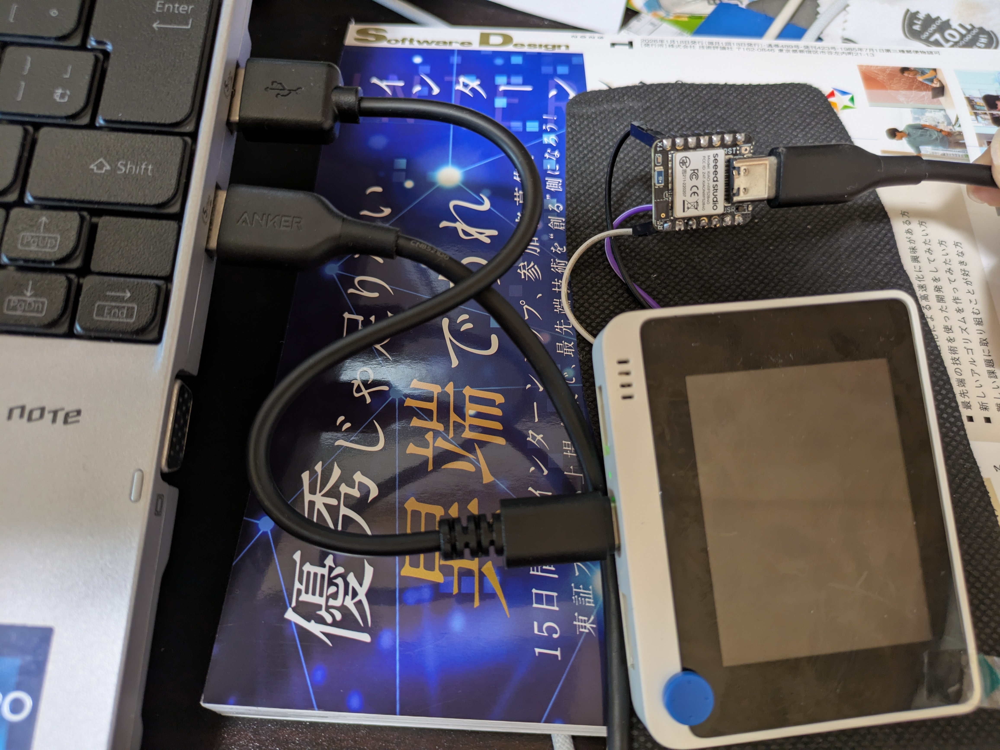||


---

- 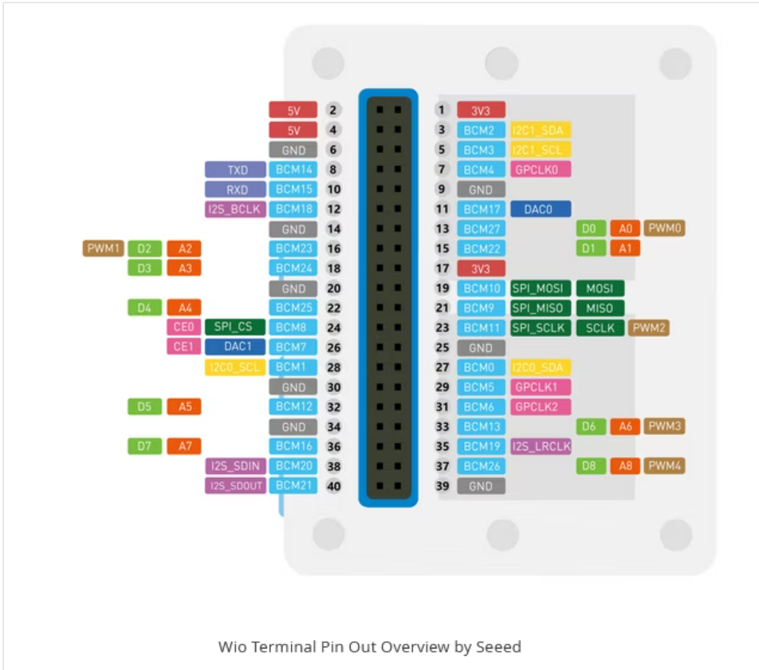
  - [Qiita](https://qiita.com/sago35/items/92b22e8cbbf99d0cd3ef#wio-terminal-%E3%81%AE%E5%91%A8%E8%BE%BA%E3%83%87%E3%83%90%E3%82%A4%E3%82%B9%E3%82%92%E4%BD%BF%E7%94%A8%E3%81%99%E3%82%8B)

- 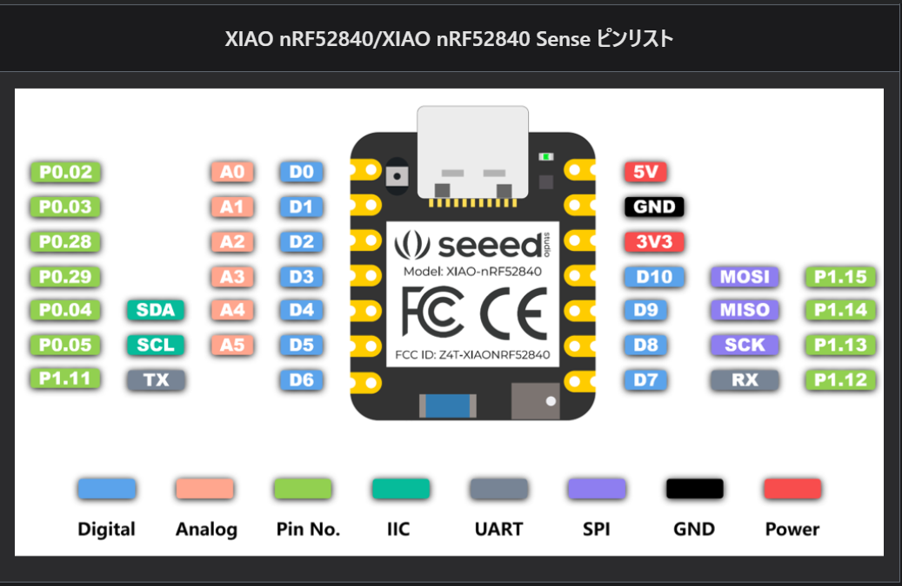
  - https://wiki.seeedstudio.com/ja/XIAO_BLE/

### WIO Terminal側
- 5方向スイッチ操作でUART送信 -> nRF52840
- [プログラム](./wio_button_uart/main.go)

### XIAO nRF52840側
- UART受信 -> BLE送信
- [プログラム](./nrf52840_uart_ble_bridge/main.go)

## セットアップ

1. WIO Terminalにフラッシュ

    ```sh
    tinygo flash --target wioterminal --size short .\wio_button_uart\
    ```
1. XIAO nRF52840にフラッシュ

    ```sh
    tinygo flash -target=xiao-ble .\nrf52840_uart_ble_bridge\
    ```

1. WIO Terminal側（yterm）
    ```sh
    yterm --target wioterminal  --port COM10
    ```
1. XIAO nRF52840側（別ターミナルで）

    ```sh
    yterm --target xiao-ble --port COM13
    ```

1. スマホアプリ
    1. nRF Connectで「WIO-BLE」に接続
        - 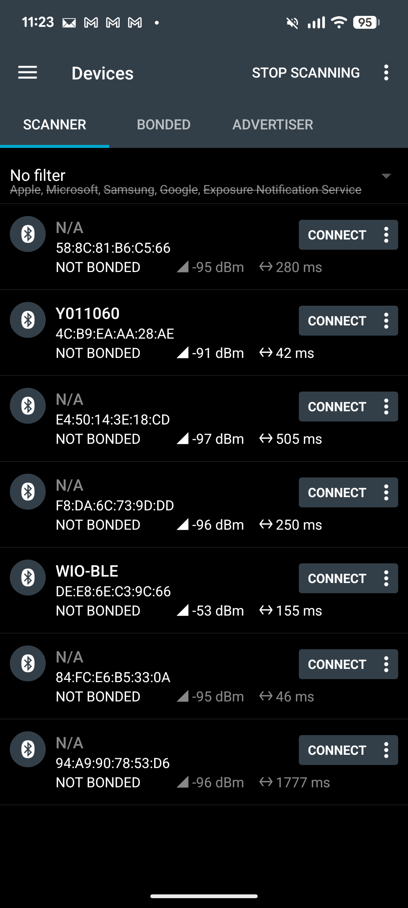
    1. Nordic UART Serviceを開く
        - 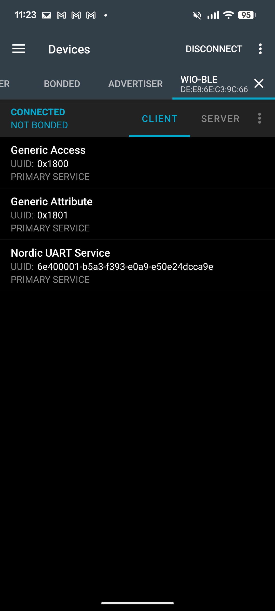
        - 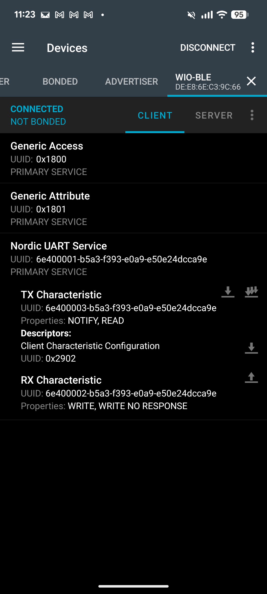

## 動作確認

### ボタン→BLE
1. WIO Terminalの5方向スイッチを押す（例：UPで「Hello」, 右で「Right」）
1. ytermに「[WIO->nRF] Hello」と表示
    - 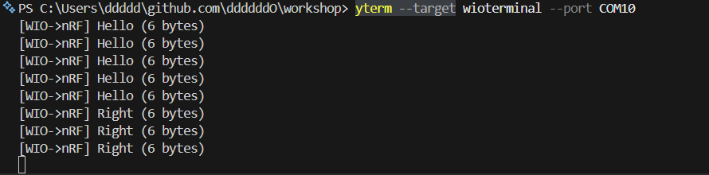
1. XIAO側のytermに「[UART->BLE] Hello」と表示
    - 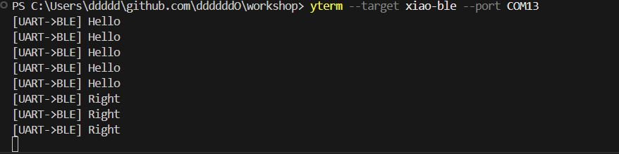
1. スマホアプリで「Hello」を受信
    - 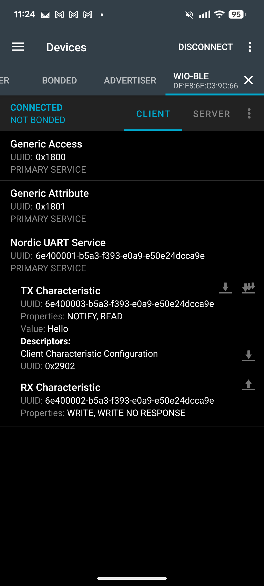

### BLE→WIO Terminal
1. スマホアプリから「good!!」を送信
    |RX Characteristicの`↑`タップし|入力して`SEND`|
    |--|--|
    ||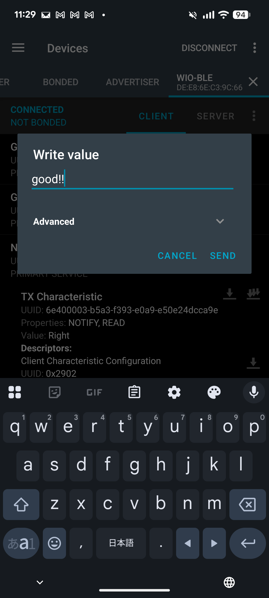|

1. XIAO側のytermに「[BLE->UART] good!!」と表示
    - 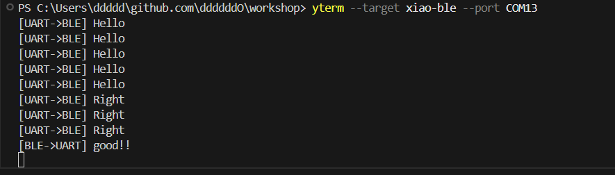
1. WIO Terminal側のytermに「[nRF->WIO] good!!」と表示
    - 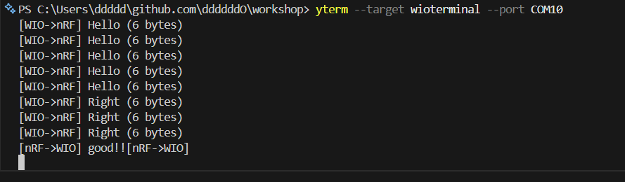

## メモ

- WIO TerminalにもBluetoothが使えるチップがあるが、tinygoで対応してないみたい?（2026/02/23）
- 今持ってるWIO Terminalの5v / 3.3vピン（裏側の40pinの）が死んでるみたい
    - PC <-> FT232 <-> mh-z19b で、mh-z19bが薄っすら赤く光ってたかつセンサー値とれたので、センサー側は生きてる。WIO Terminalにつないだけど、赤く光りすらしなかった
        - 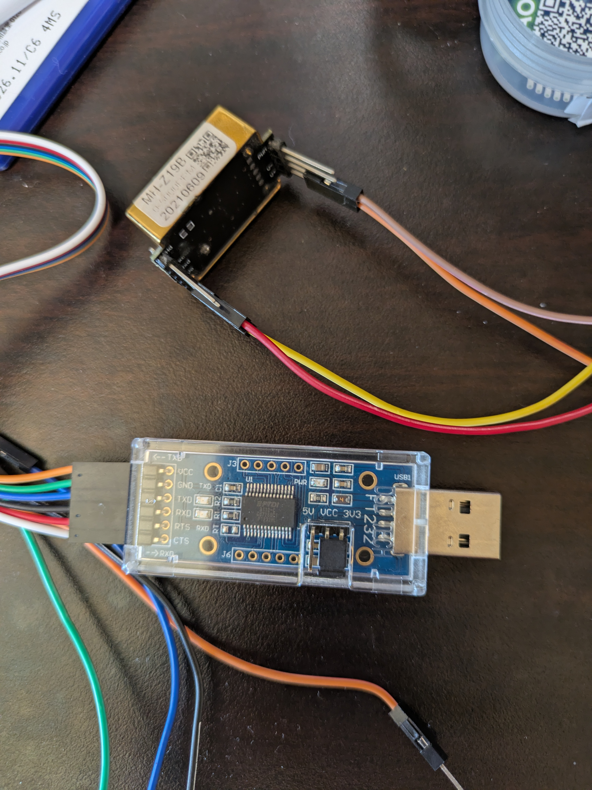
